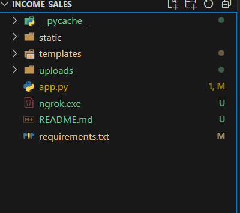

## Application for Financial Data Prediction and Tex calculation

### Overview
This web application allows users to upload financial data in Excel format and predict key financial metrics such as **Net Income**, **Sales**, **Zakat/Tax**, and **Cost of Sales** using an LSTM (Long Short-Term Memory) model and calculate the NEt Income.

### Features
- **File Upload**: Upload Excel files with financial data.
- **Data Validation**: Checks for required columns and ensures no negative values.
- **LSTM Model**: Predicts future financial metrics.
- **Net Income calc**: Calc the net income befour and after tex.

### Setup Instructions

## Requirements

- Python 3.10 or later
1) Download and install MiniConda form [here](https://docs.anaconda.com/miniconda/#miniconda-latest-installer-links)

2) Create a new environment using the following command
```bash
$ conda create -n financial-prediction-env python=3.10
```
3) Activate the environment:
```bash
$ conda activate financial-prediction-env
```

## Installation

### Install the required packages

```bash
$ pip install -r requirements.txt
```

## Run the App
```bash
$ python app.py
```

# ngrok Setup for Application

This guide provides step-by-step instructions for downloading, setting up, and using ngrok to expose your Flask application to the internet.

## Table of Contents
1. [Download ngrok](#step-1-download-ngrok)
2. [Set Up ngrok](#step-2-set-up-ngrok)
3. [Start Your Flask Application](#step-3-start-your-flask-application)
4. [Start ngrok](#step-4-start-ngrok)
5. [Access Your Application](#step-5-access-your-application)


## Step 1: Download ngrok

1. **Go to the ngrok Website**:
   - Visit [ngrok.com](https://ngrok.com/download).

2. **Choose the Correct Version**:
   - Download the ngrok version suitable for your operating system (Windows, macOS, or Linux).

3. **Extract the Downloaded File**:
   - After downloading, unzip the downloaded file to a folder of your choice (e.g., `C:\Users\YourUsername\ngrok`).


## Step 2: Set Up ngrok

1. **Add ngrok to Your PATH** 

    


2. **Authenticate Your ngrok Account** (if applicable):
   - Sign up for a free account on the ngrok website.
   - After signing in, you will find your authentication token in the dashboard.
   - Run the following command to authenticate ngrok (replace `YOUR_AUTH_TOKEN` with your actual token):
     ```bash
     ngrok config add-authtoken YOUR_AUTH_TOKEN
     ```

## Step 3: Start Your Flask Application

## Run the App
```bash
$ python app.py
```

## Step 4: Start ngrok

1. **Open a New Terminal**:
   - Open a new command prompt or terminal window.

2. **Run ngrok**:
   - Use the following command to start ngrok and forward traffic to your Flask app:
     ```bash
     .\ngrok.exe http 5000
     ```

## Step 5: Access Your Application

- After running the command, ngrok will provide a public URL (e.g. ) that you can use to access your app from the internet.

